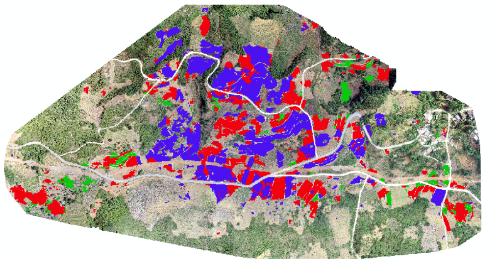
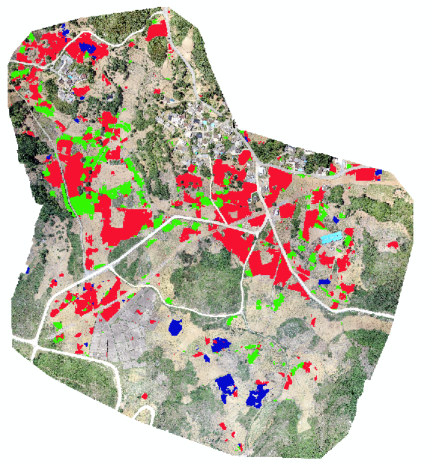

# 2019年县域农业大脑AI挑战赛

由于精力有限，事务繁忙；本赛题花费时间较短，没做什么操作，提交只有几次。撒花🤣🤣🤣。

## 赛题解读

1. 网格化农作物产产能精准预测

2. 兴仁市是我国薏仁米主产区

## v1.0

基于分类：      
1. 根据标记像素所占比例，分出四类；  
2. 四分类，获取基本模型；  
3. 在基本模型上，对其他类（标记为0）进行清洗；
4. 微调基本模型；  
5. 分类，~~后处理~~，出结果。

在线精度：0.1792。切割尺寸：224。

- 可以尝试结合上述数据清洗的思路，清洗完后使用语义分割模型。

## v2.*

使用Unet-densenet121语义分割，不固定前端。切割大小512，旋转变换增强后分类输入384，损失函数cce_jaccard_loss。
在线精度：0.2495。

使用Unet-densenet121语义分割，切割大小1500，旋转变换增强Resize到384输入，损失函数cce_dice_loss。
没来的及提交。下面是效果图。

## 总结

- 分割问题还是用分割来做，当然如果时间精力较多，可以尝试分类方案，但效果应该没分割好。
- 掌握时间，合理安排事务，看远点调度。时间有限时，先试用经典的损失函数，网上的方案（有的已经帮你排除了一些奇怪的设置）。