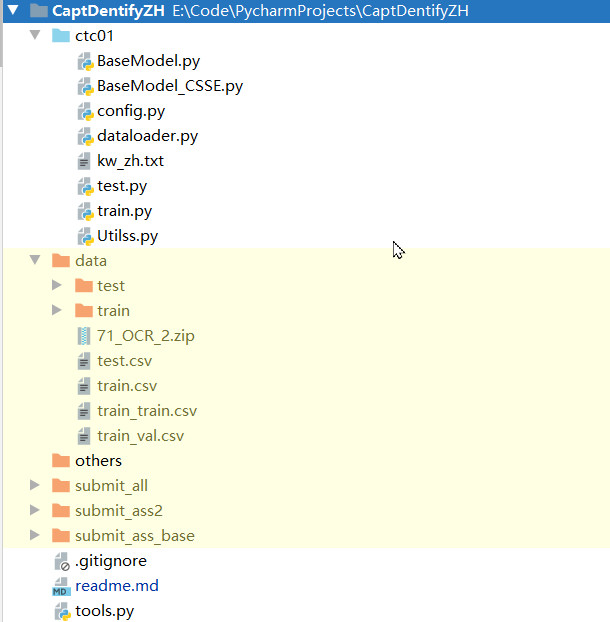
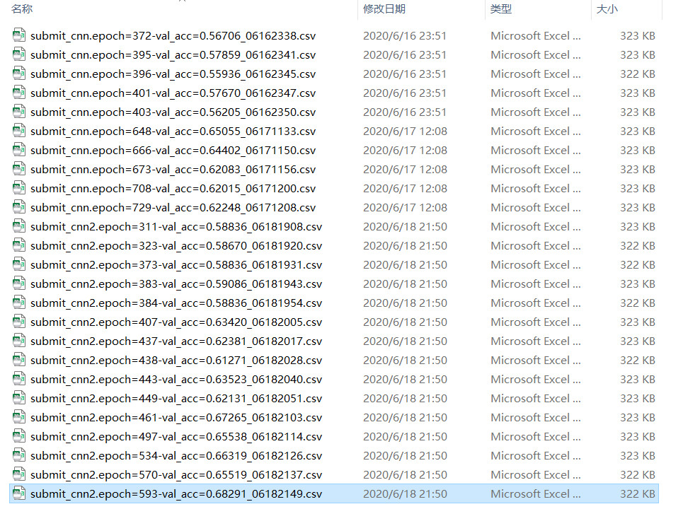
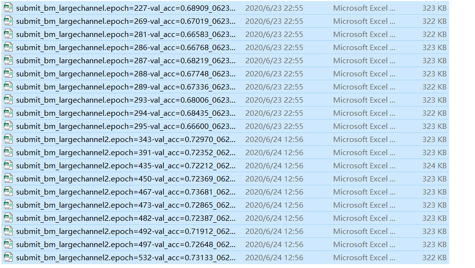
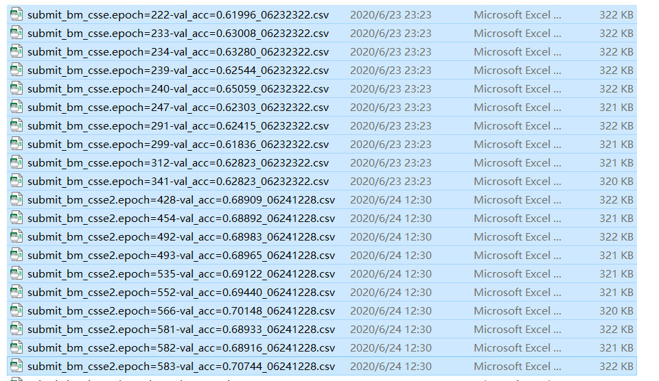
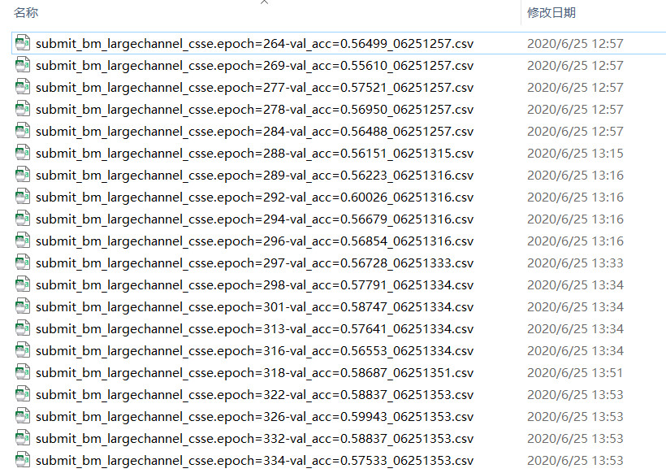

# 团队信息
[吐泡泡]()

# 比赛信息
变长英文验证码识别（验证码二）

[比赛网址]()

# 文件结构


# 实验方法及结果
训练验证9:1。
优化器Radam+Lookahead+CosineAnnealingWarmRestarts,先后使用学习率1e-2，权重衰减1e-5；学习率1e-4，权重衰减1e-3。迭代中重启继续训练。关键词如下：
- 结果投票
- 数据增强
- 标签空格随机插入
- FP16半精度
- 模型训练Top10权重保存
- TTA，多线程

## BaseModel.py
```python
channels = [32, 64, 128, 256, 256] # 小channel
```



```python
channels = [64, 128, 256, 512, 512] # 大channel
```


## BaseModel_CSSE.py
引入CSSE注意力模块
```python
channels = [32, 64, 128, 256, 256] # 小channel
```


```python
channels = [64, 128, 256, 512, 512] # 大channel
```
